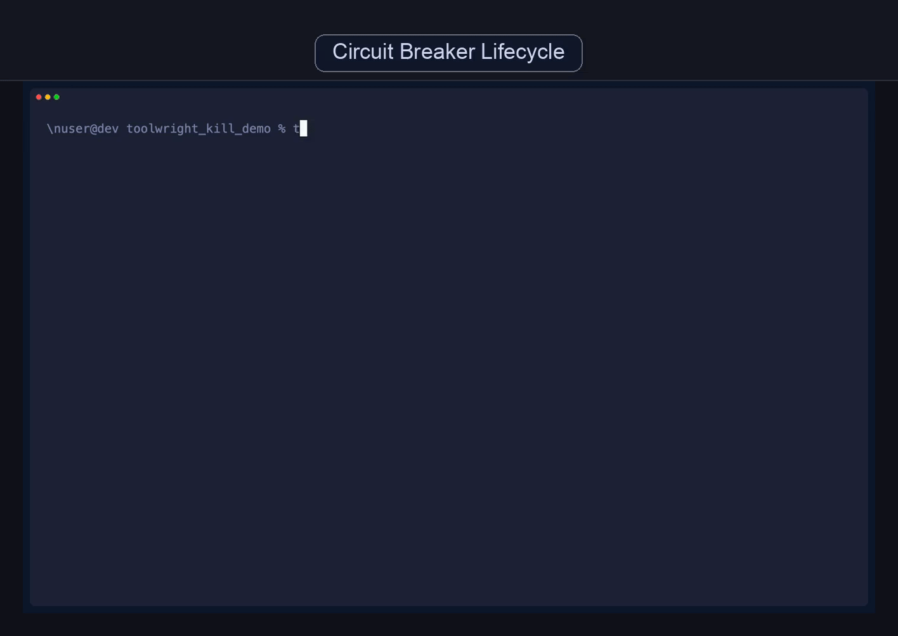

# Toolwright

> Give your AI agent any API. Safely.

Browse any API for 30 seconds. Toolwright turns your traffic into governed MCP tools -- risk-classified, cryptographically signed, and self-repairing. No code required.


## The Magic Moment

```bash
# You browsed Stripe's dashboard for 30 seconds. Now:
$ toolwright mint https://dashboard.stripe.com -a api.stripe.com

  Captured 47 API calls across 12 endpoints
  Compiled 12 tools (8 read, 3 write, 1 admin)
  Risk classified: 3 low, 6 medium, 2 high, 1 critical
  Auth detected: Bearer token (Authorization header)

$ toolwright gate allow --all
$ toolwright serve
  12 governed tools ready for your agent
```

Your agent just gained 12 new capabilities. Each one is risk-classified, signed, and governed by circuit breakers and behavioral rules.

## Try It in 30 Seconds

```bash
pip install toolwright
toolwright demo
```

## Quick Start

### 1. Discover and compile tools

```bash
toolwright init
toolwright mint https://app.example.com -a api.example.com
```

Or import from a HAR file or OpenAPI spec:

```bash
toolwright capture import recording.har -a api.example.com
toolwright compile --capture <capture_id> --scope first_party_only
```

### 2. Approve and serve

```bash
toolwright gate allow --all            # approve discovered tools
toolwright auth check                  # verify your API token is configured
toolwright serve                       # start the governed MCP server
```

### 3. Connect to your AI agent

```bash
toolwright config                      # generates config for Claude Desktop, Cursor, etc.
```

## How It Works

1. **Capture**: Toolwright observes real API traffic (browser, HAR, or OpenAPI spec) and identifies every endpoint, method, and parameter.
2. **Compile**: Raw observations become typed MCP tool definitions with inferred schemas and risk tiers.
3. **Govern**: A cryptographic lockfile tracks approval state. Nothing runs without explicit sign-off.
4. **Serve**: The MCP server exposes only approved tools, enforcing policy, confirmation gates, and circuit breakers at runtime.

## The Five Pillars

| Pillar | What It Does | Maturity |
|--------|-------------|----------|
| **CONNECT** | Discover, compile, and register new API tools | Stable |
| **GOVERN** | Risk-classify, sign, approve, and audit every tool | Stable |
| **HEAL** | Diagnose failures and repair broken tools | Beta |
| **KILL** | Circuit-break misbehaving tools with instant kill switches | Beta |
| **CORRECT** | Enforce durable behavioral rules across sessions | Early |

## Authentication

Toolwright detects auth requirements during capture and tells you exactly which env var to set:

```bash
# Global (all hosts)
export TOOLWRIGHT_AUTH_HEADER="Bearer your-token"

# Per-host (for multi-API toolpacks)
export TOOLWRIGHT_AUTH_API_GITHUB_COM="Bearer github-token"
export TOOLWRIGHT_AUTH_API_STRIPE_COM="Bearer stripe-token"
```

Verify your setup:

```bash
toolwright auth check
```

## What's Under the Hood

### Governance & Approval

Every tool goes through a governance pipeline: automatic risk classification, Ed25519 cryptographic signing, tamper-evident lockfiles, configurable policy rules, and full audit logging. Write operations require human confirmation tokens.

### Circuit Breakers (KILL)



Per-tool circuit breakers trip after repeated failures and auto-recover. Operators can manually kill or re-enable tools:

```bash
toolwright kill flaky_api --reason "Upstream 500s"
toolwright quarantine                  # see what's killed
toolwright enable flaky_api            # bring it back
```

### Behavioral Rules (CORRECT)

Define persistent constraints agents must follow -- no retraining required:

```bash
toolwright rules add --kind prerequisite --target update_user \
  --requires get_user --description "Must fetch before update"

toolwright rules add --kind prohibition --target delete_user \
  --description "Never delete users"
```

### Drift Detection & Self-Repair (HEAL)

Detect when APIs change and automatically repair broken tools:

```bash
toolwright drift --capture-a <old> --capture-b <new>
toolwright repair
```

### MCP Meta-Server

Agents can query and manage their own tool infrastructure via MCP meta-tools:
introspection (`toolwright_list_actions`, `toolwright_risk_summary`),
diagnosis (`toolwright_diagnose_tool`, `toolwright_health_check`),
kill switches (`toolwright_kill_tool`, `toolwright_enable_tool`),
and behavioral rules (`toolwright_add_rule`, `toolwright_list_rules`).

## Installation

```bash
pip install toolwright                 # core
pip install "toolwright[playwright]"   # + browser capture
pip install "toolwright[mcp]"          # + MCP server
pip install "toolwright[all]"          # everything
```

## Architecture

```
  Agent (Claude, GPT, etc.)
       |
       v
  +---------------+
  |  MCP Server   |  <-- toolwright serve
  |  (governed)   |
  +-------+-------+
          |
  +-------+-------+
  | Policy Engine | Risk tiers, method filtering,
  | + Rules       | confirmations, behavioral rules
  +-------+-------+
          |
  +-------+-------+
  | Circuit       | Per-tool CLOSED/OPEN/HALF_OPEN
  | Breakers      | with auto-recovery & kill switch
  +-------+-------+
          |
          v
    Upstream API
```

**Alias:** `tw` works as a shorthand for `toolwright`.

Full CLI reference and detailed docs: [docs/user-guide.md](docs/user-guide.md)

## Design Principles

- **Safe by default**: All capture and enforcement requires explicit allowlists
- **Redaction on**: Sensitive data (cookies, tokens, PII) is removed by default
- **Audit everything**: Every compile, drift, and enforce decision is logged
- **Compiler mindset**: Convert behavior into contracts, not scan for vulnerabilities
- **Plug and play**: Minimal configuration required to get started

## License

MIT
